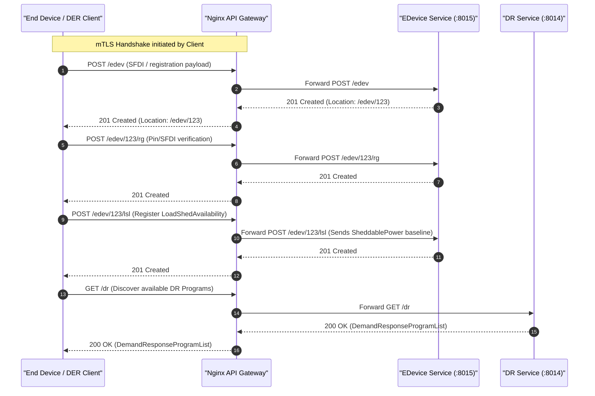
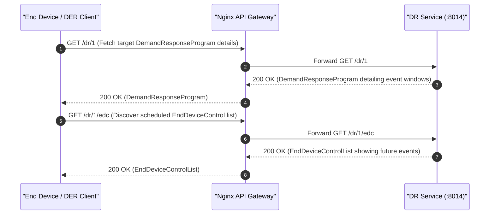
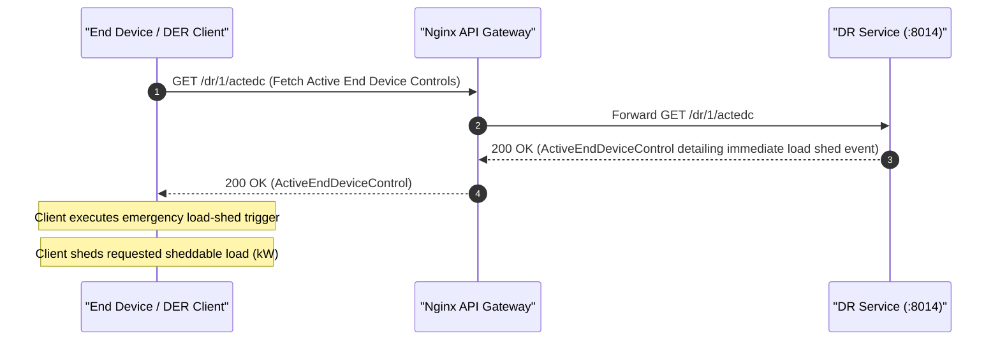
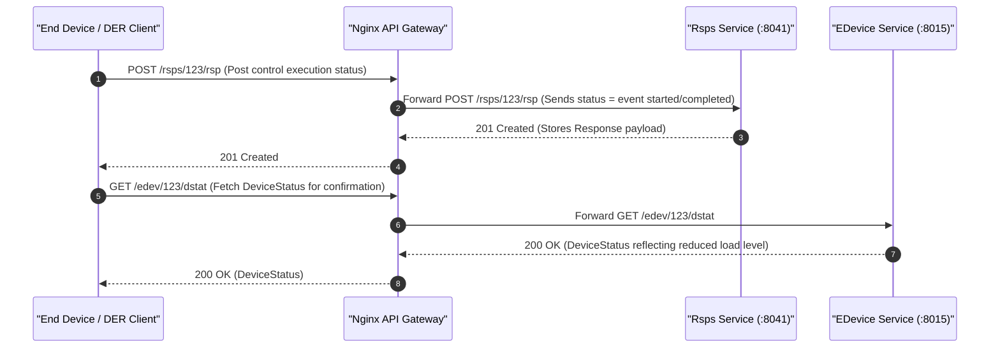
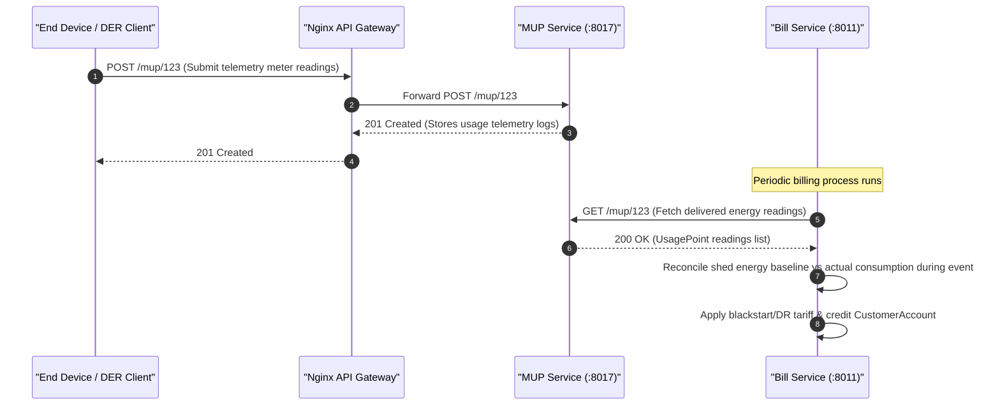

# ESI Lifecycle Sequence Diagrams: Blackstart & DR Dispatch

This document covers the client/server interactions and sequence diagrams for the **Blackstart & DR Dispatch** grid service (cold-start recovery / feeder load-shed dispatcher) across all 5 ESI lifecycle phases.

---

## 1. Registration

In the Registration phase, the client registers as an End Device, registers its load-shed capacity telemetry (SheddablePower), and discovers available Demand Response (DR) programs.

---

## 2. Scheduling

In the Scheduling phase, the client queries scheduled End Device Controls (EDC) associated with the Demand Response Program to identify future planned events.

---

## 3. Operation

During the Operation phase (e.g. during a cold-start recovery or emergency feeder overload), the operator triggers a critical load-shed event. The client fetches active controls, parses the emergency signal, and immediately disconnects or limits its load.

---

## 4. Verify

In the Verification phase, the client posts confirmation responses to the Rsps service and updates its Device Status to prove command compliance.

---

## 5. Settlement

In the Settlement phase, telemetry data from the Mirror Usage Point is evaluated by the Billing service against the customer agreement and the baselines to credit the account for emergency load shedding.

