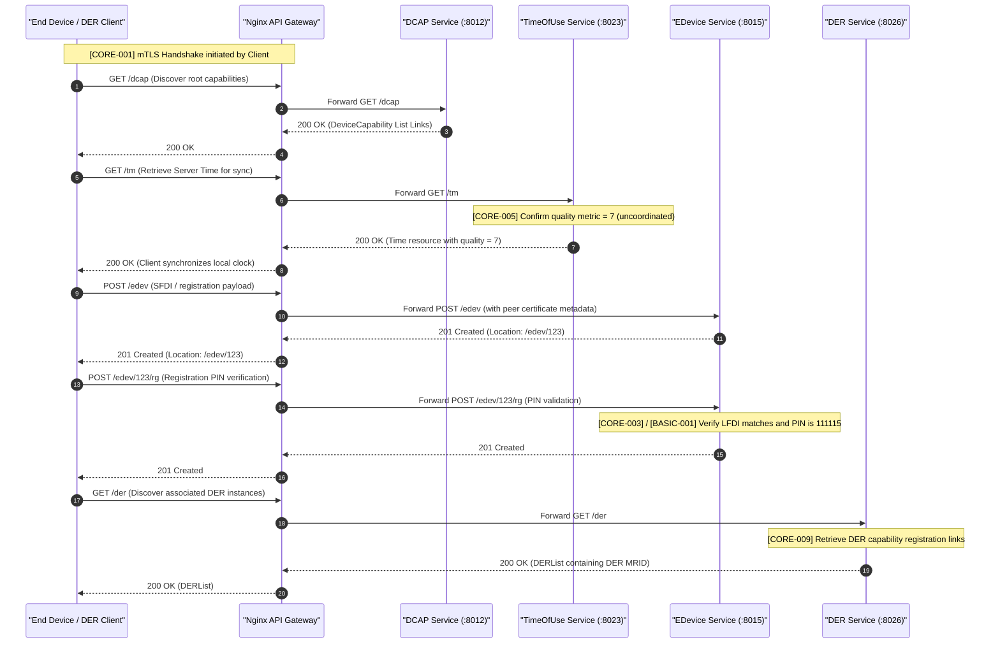
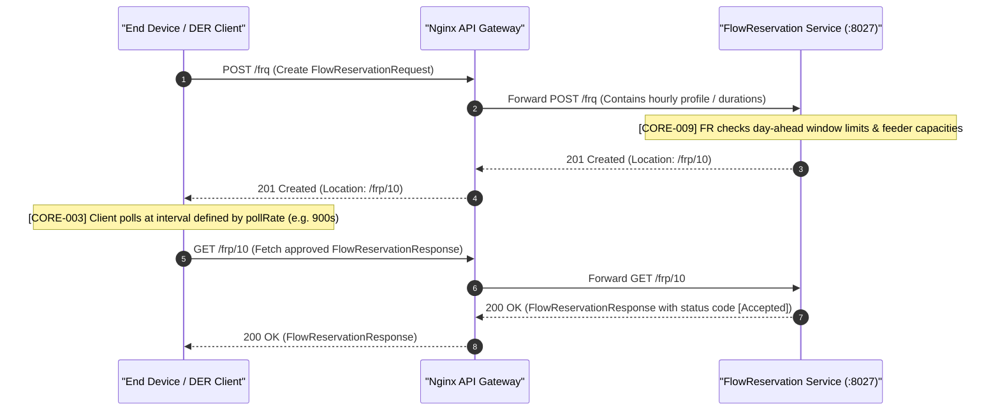
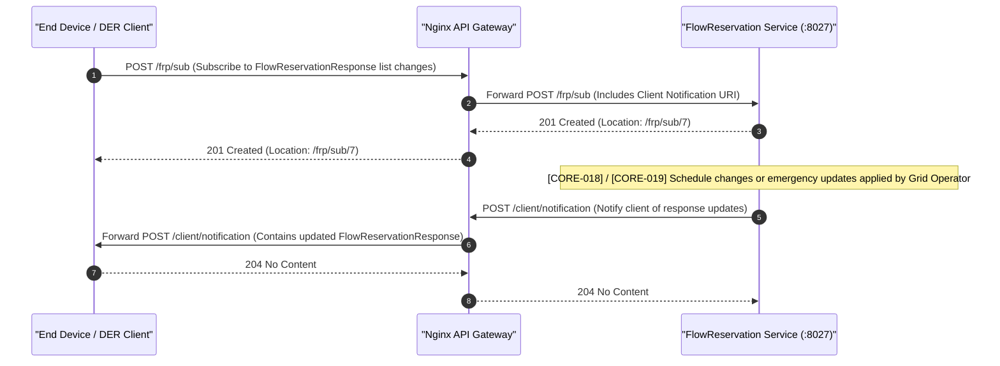
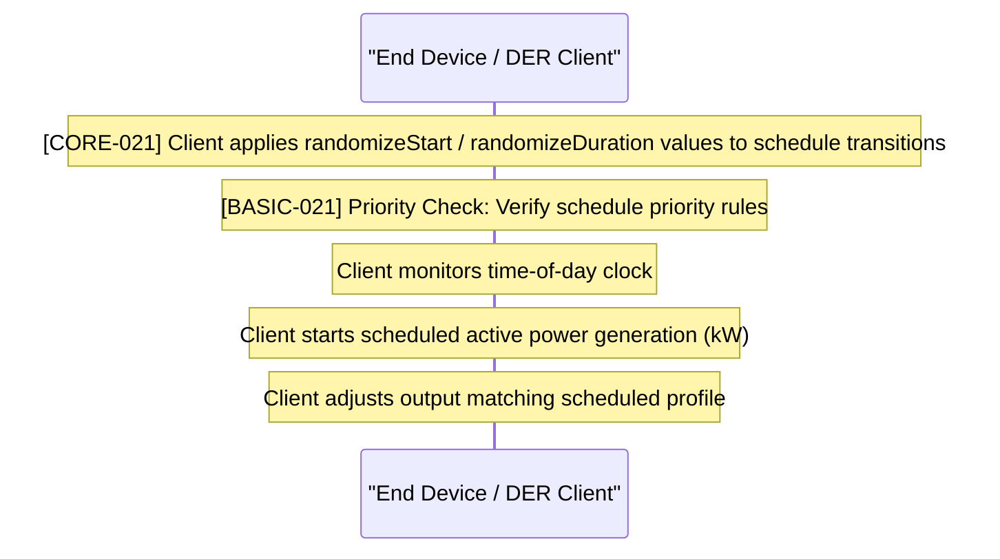
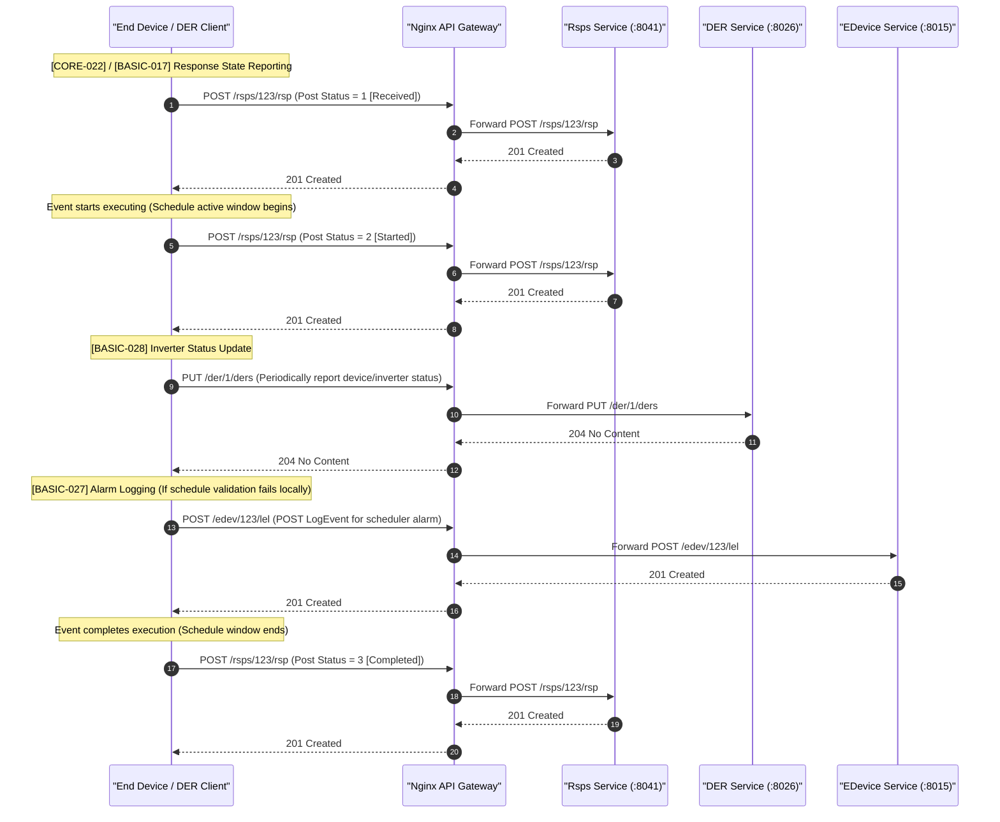
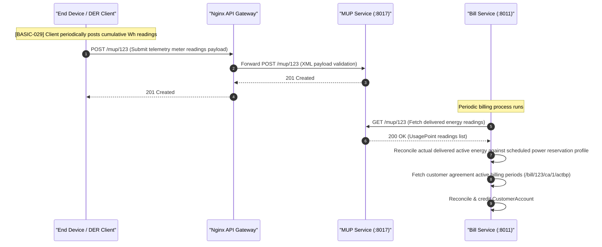

# ESI Lifecycle Sequence Diagrams: Energy Scheduling

This document covers the client/server interactions and sequence diagrams for the **Energy Scheduling** grid service (longer-term / Day-Ahead hourly power injection schedules) across all 5 ESI lifecycle phases, aligned with IEEE 2030.5 CSIP test procedures.

---

## 1. Registration

During Registration, the client performs discovery, synchronizes time, and registers its identity.

---

## 2. Scheduling

In the Scheduling phase, the client requests a multi-hour or Day-Ahead energy schedule by posting a FlowReservationRequest, and fetches or subscribes to the approved FlowReservationResponse.

### Option A: Polling Interaction

### Option B: Subscription/Notification

---

## 3. Operation

During the Operation phase, the client monitors the time-of-day clock, applies event randomization, manages priorities, and executes active power injections or draws according to the scheduled active hour blocks.

---

## 4. Verify

In the Verification phase, the client posts status confirmations, reports execution states, updates statuses, and logs alarms.

---

## 5. Settlement

In the Settlement phase, telemetry data is evaluated by the Billing service to credit the customer for active power delivery.

