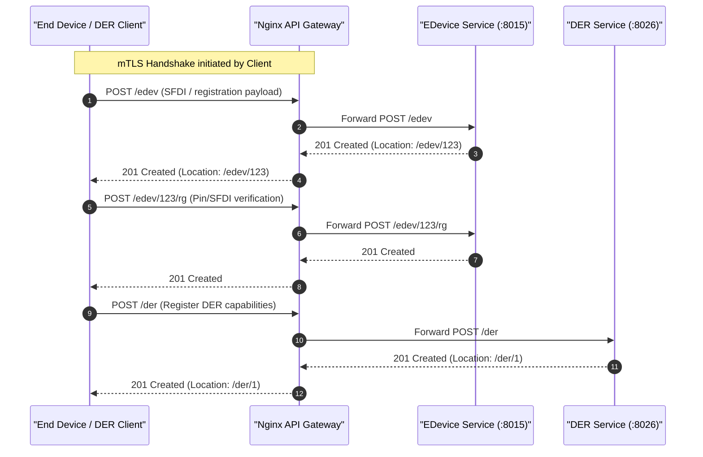
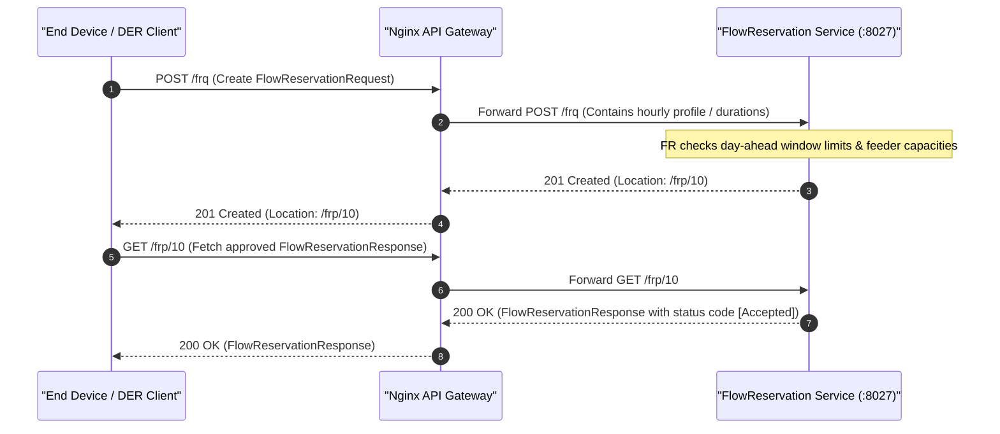
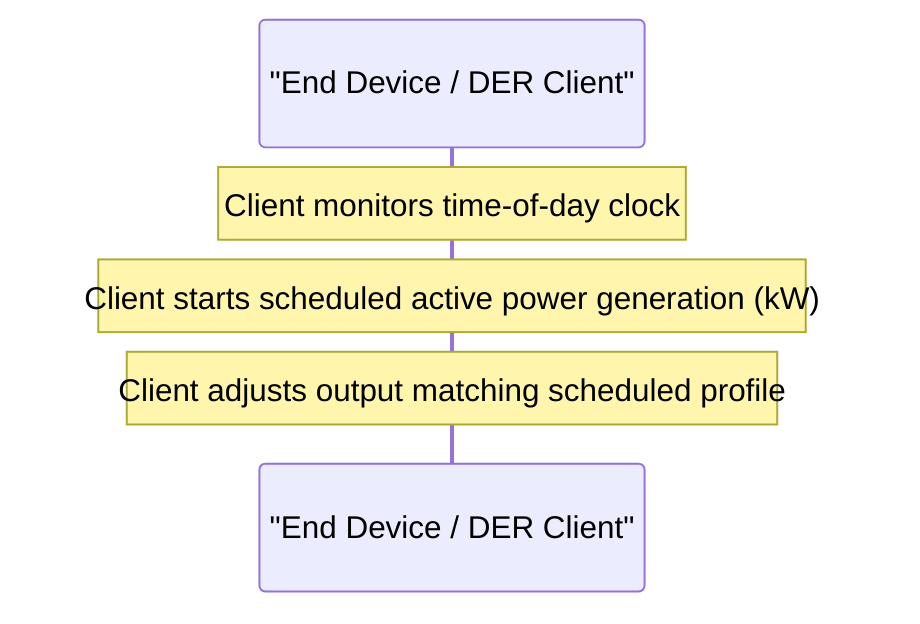
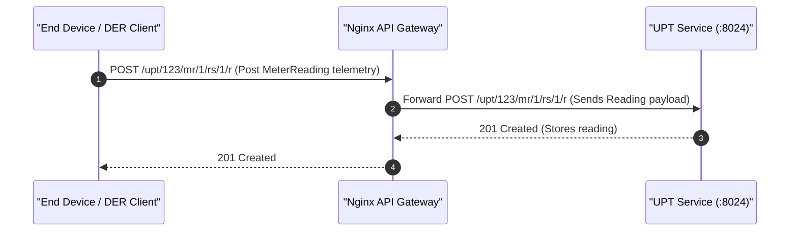
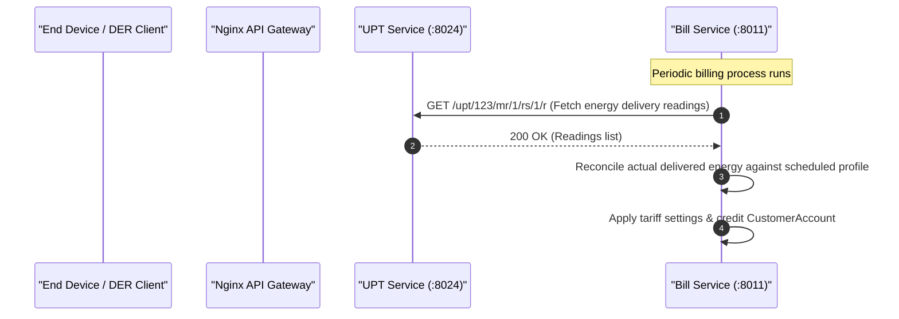

# ESI Lifecycle Sequence Diagrams: Energy Scheduling

This document covers the client/server interactions and sequence diagrams for the **Energy Scheduling** grid service (longer-term / Day-Ahead hourly power injection schedules) across all 5 ESI lifecycle phases.

---

## 1. Registration

In the Registration phase, the client registers as an End Device, registers its DER capabilities, and initializes registration settings.

---

## 2. Scheduling

In the Scheduling phase, the client requests a multi-hour or Day-Ahead energy schedule by posting a FlowReservationRequest, and fetches the approved FlowReservationResponse indicating the hourly power limits allocated by the server.

---

## 3. Operation

During the Operation phase, the client tracks the current time and executes active power injections or draws according to the scheduled active hour blocks.

---

## 4. Verify

In the Verification phase, the client posts energy meter readings to its Usage Point (UPT) service to record cumulative Wh energy delivery.

---

## 5. Settlement

In the Settlement phase, the Billing service processes the registered customer agreement, retrieves actual metered energy data, and reconciles output vs schedule to credit the customer.

