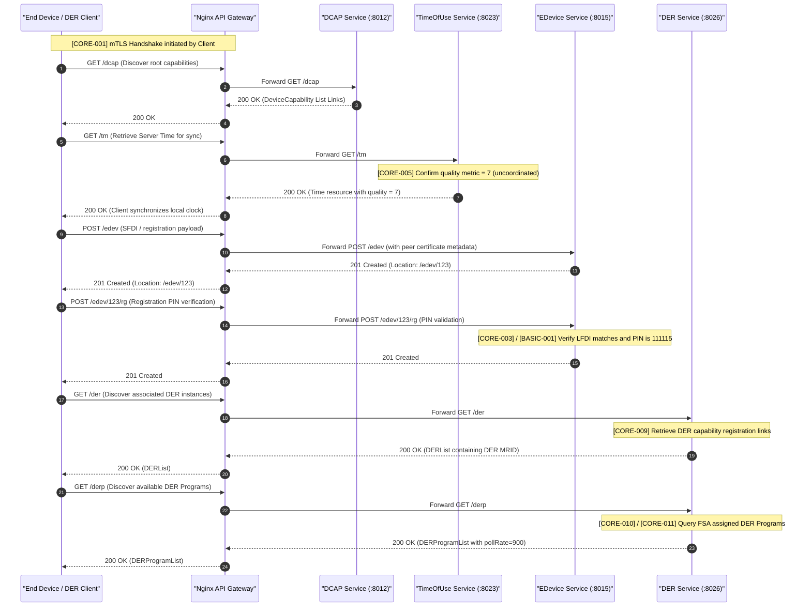
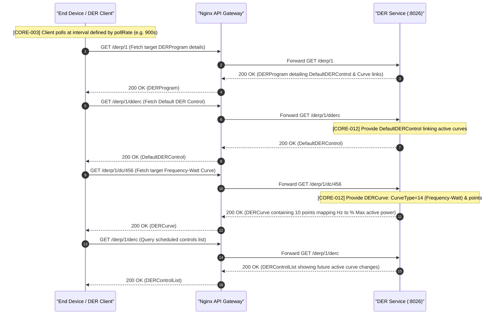
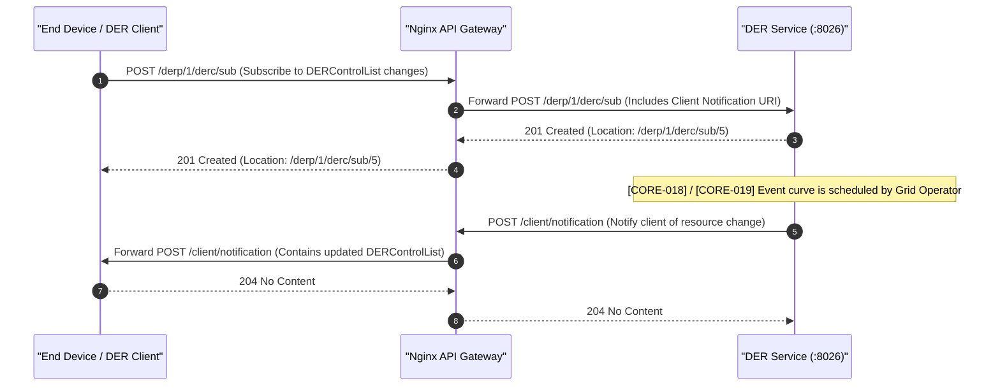
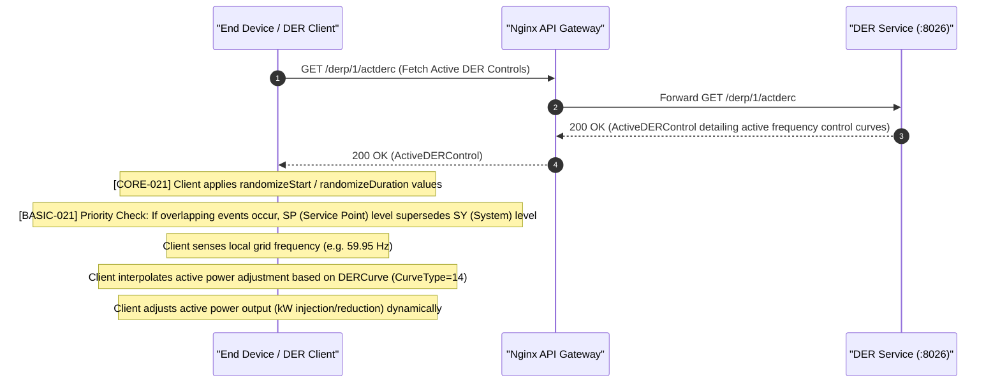
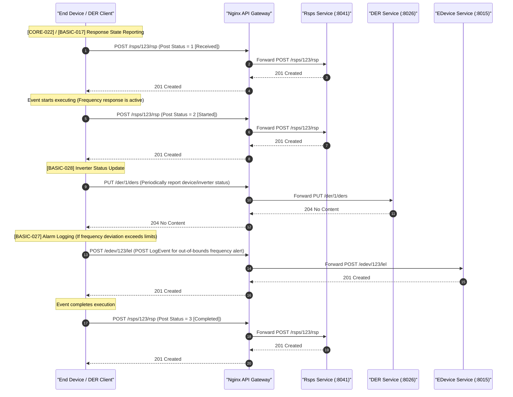
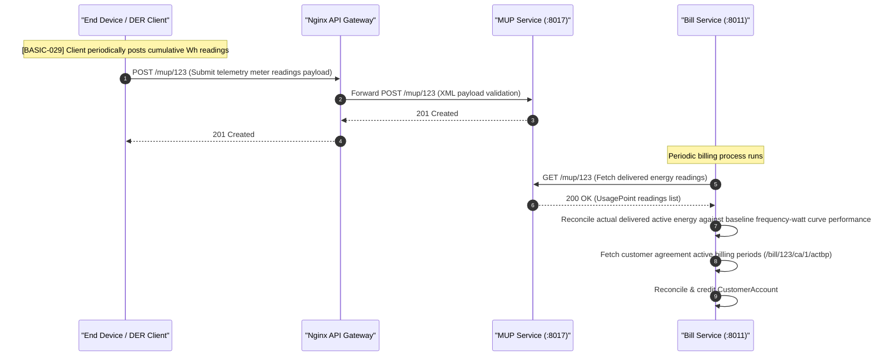

# ESI Lifecycle Sequence Diagrams: Frequency Response

This document covers the client/server interactions and sequence diagrams for the **Frequency Response** grid service (Frequency-Watt / active power adjustment based on local frequency deviations) across all 5 ESI lifecycle phases, aligned with IEEE 2030.5 CSIP test procedures.

---

## 1. Registration

During Registration, the client performs discovery, synchronizes time, and registers its identity.

---

## 2. Scheduling

In the Scheduling phase, the client monitors and parses future planned Frequency-Watt control curves using either Polling or Subscriptions.

### Option A: Polling Interaction

### Option B: Subscription/Notification

---

## 3. Operation

During the Operation phase, the client tracks active controls, applies event randomization, manages priorities, and executes the dynamic Frequency-Watt active power adjustment.

---

## 4. Verify

In the Verification phase, the client posts status confirmations, reports execution states, updates statuses, and logs alarms.

---

## 5. Settlement

In the Settlement phase, telemetry data is evaluated by the Billing service to credit the customer for active power support.

