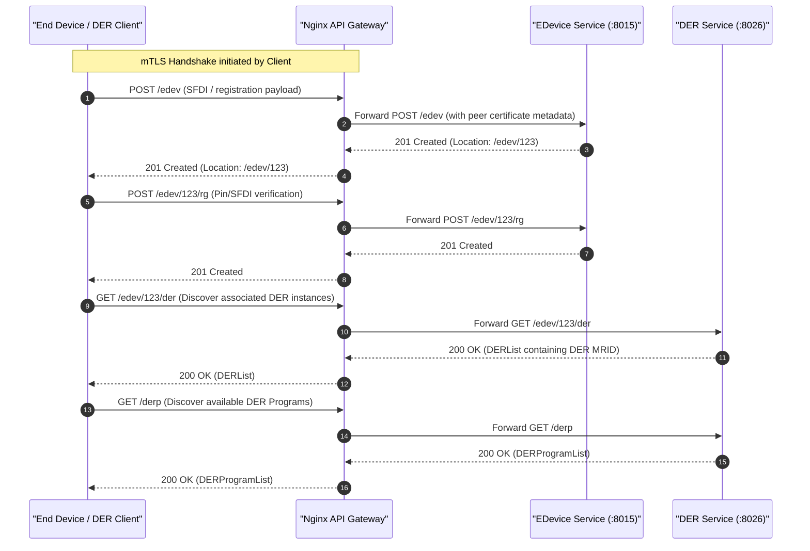
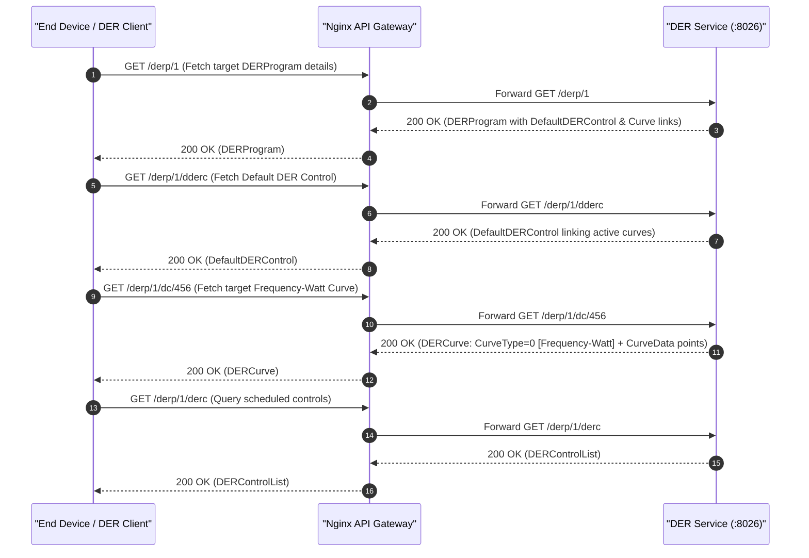
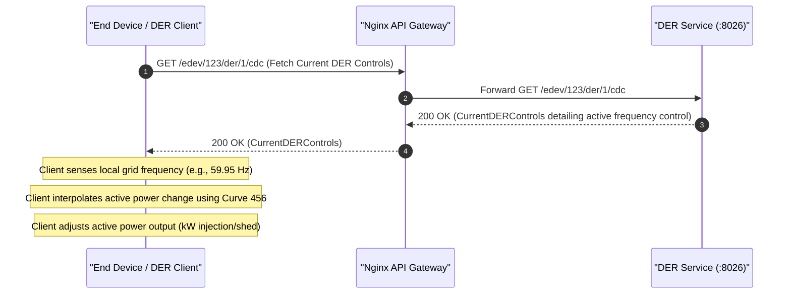
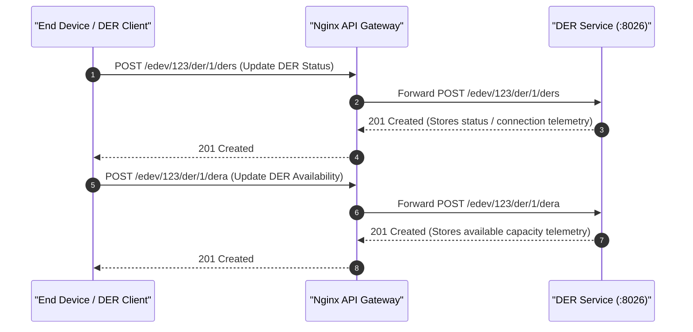
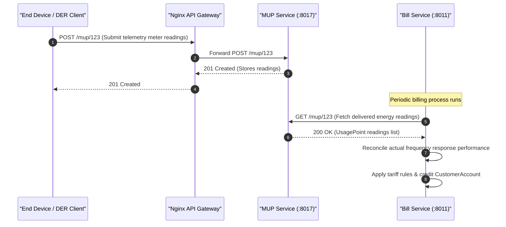

# ESI Lifecycle Sequence Diagrams: Frequency Response

This document covers the client/server interactions and sequence diagrams for the **Frequency Response** grid service (Frequency-Watt / active power adjustment based on local frequency deviations) across all 5 ESI lifecycle phases.

---

## 1. Registration

In the Registration phase, the client (End Device/DER) registers itself with the server to establish an authenticated session, registers its DER capability, and discovers available DER programs that offer Frequency Response.

---

## 2. Scheduling

In the Scheduling phase, the client fetches the details of the Frequency Response program, subscribes to control lists, and retrieves the specific Frequency-Watt control curves configured by the utility.

---

## 3. Operation

During the Operation phase, the client monitors real-time active controls, senses local grid frequency, and adjusts its active power output dynamically in accordance with the configured Frequency-Watt curve.

---

## 4. Verify

In the Verification phase, the client submits status and availability telemetry to verify compliance with the requested control parameters.

---

## 5. Settlement

In the Settlement phase, telemetry data posted via Mirror Usage Points is reconciled against customer agreements and active tariffs by the Billing service to calculate financial incentives or penalties.

