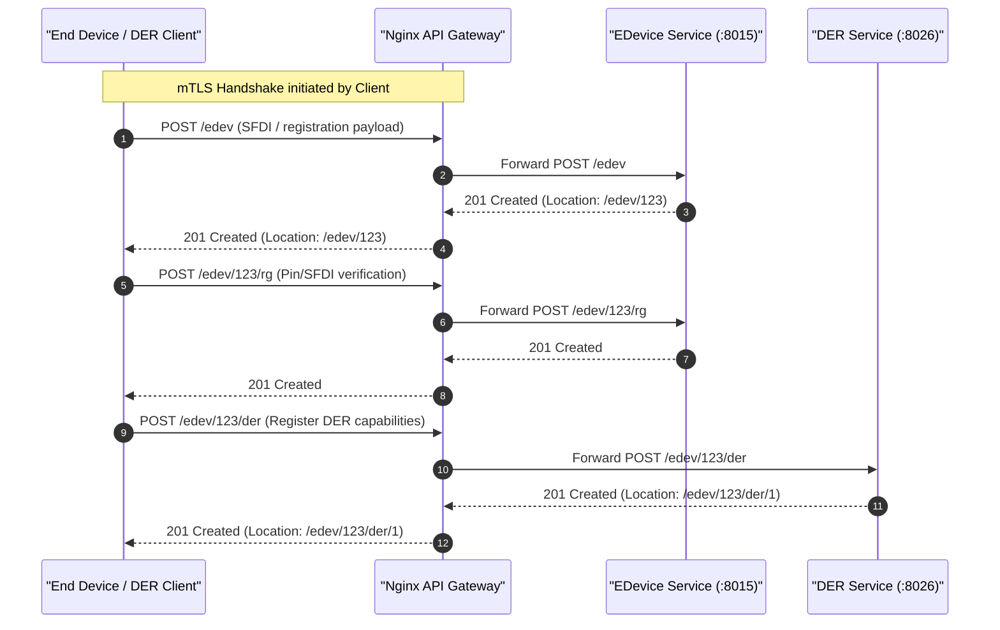
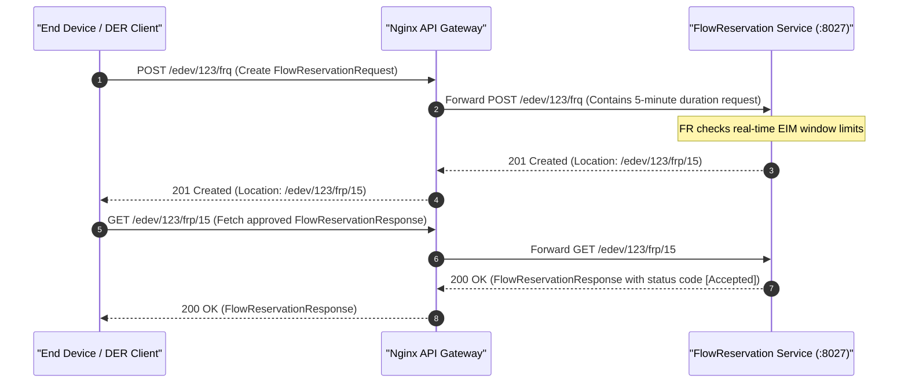
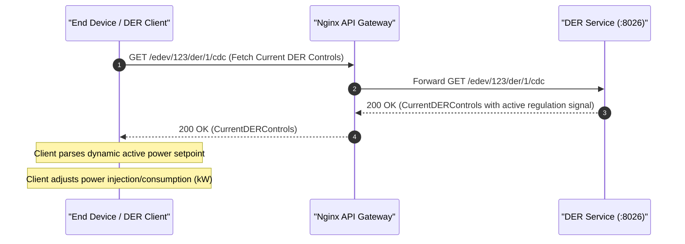
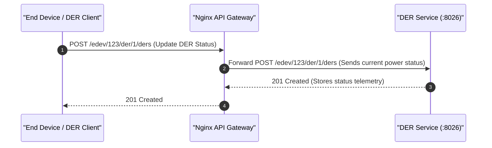
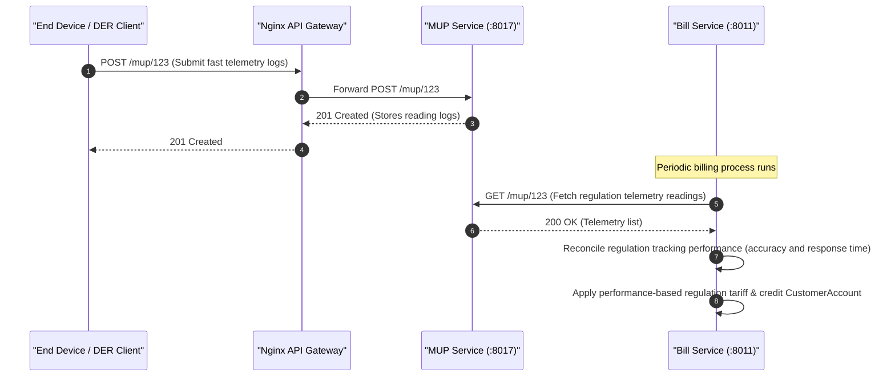

# ESI Lifecycle Sequence Diagrams: Regulation

This document covers the client/server interactions and sequence diagrams for the **Regulation** grid service (fast active power tracking / 5-minute Energy Imbalance Market regulation) across all 5 ESI lifecycle phases.

---

## 1. Registration

In the Registration phase, the client registers as an End Device, registers its dynamic active power/regulation capabilities, and completes mTLS authentication.

---

## 2. Scheduling

In the Scheduling phase, the client requests participation in fast regulation by submitting a short-horizon (e.g. 5-minute / 300s) FlowReservationRequest, and retrieves the approved FlowReservationResponse.

---

## 3. Operation

During the Operation phase, the client monitors real-time active controls and modulates its active power generation or load consumption rapidly in response to dynamic dispatch signals.

---

## 4. Verify

In the Verification phase, the client submits high-frequency operational status updates (DERStatus) to verify exact active power tracking performance.

---

## 5. Settlement

In the Settlement phase, fast telemetry data logged via the Mirror Usage Point is evaluated by the Billing service to compute performance-based regulation payments.

