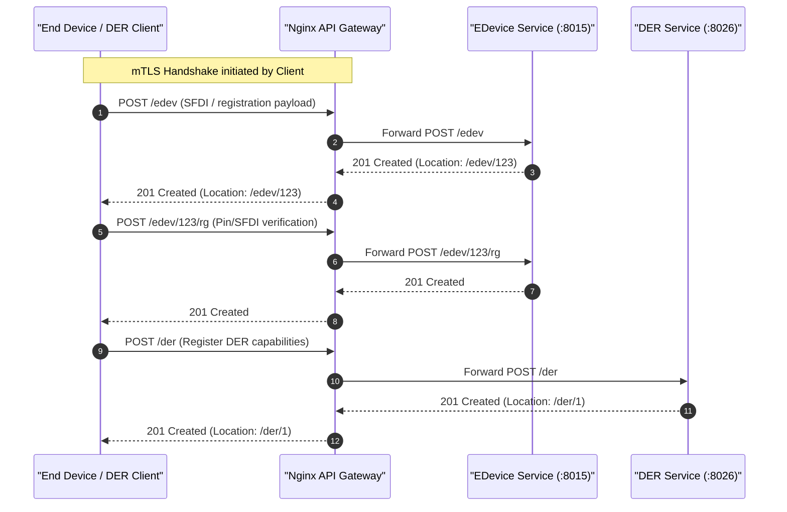
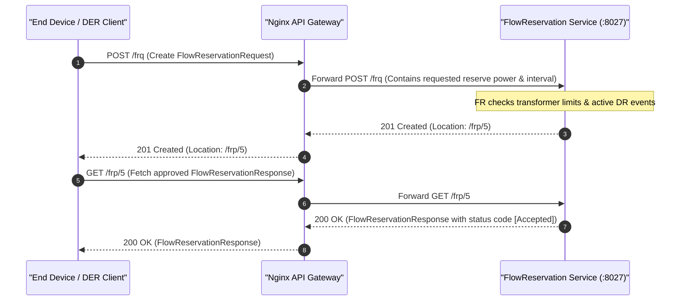
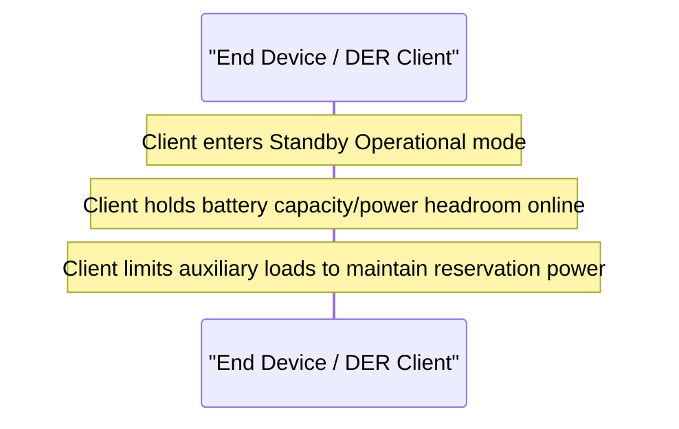
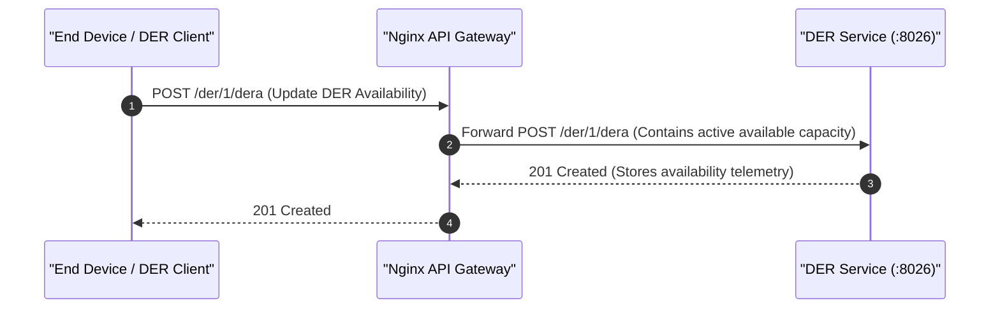
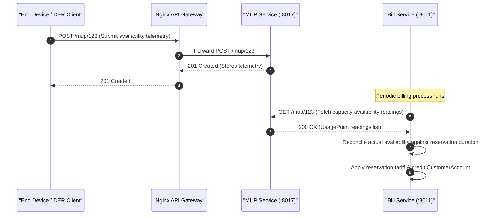

# ESI Lifecycle Sequence Diagrams: Reserve Capacity

This document covers the client/server interactions and sequence diagrams for the **Reserve Capacity** grid service (capacity reservation / spinning and non-spinning reserves) across all 5 ESI lifecycle phases.

---

## 1. Registration

In the Registration phase, the client registers as an End Device, registers its DER settings to advertise its reserve capacity limits (e.g. maximum discharge power), and registers with the Flow Reservation system.

---

## 2. Scheduling

In the Scheduling phase, the client requests a reserve capacity reservation by submitting a FlowReservationRequest, and retrieves the approved FlowReservationResponse indicating whether the reservation was accepted, modified, or rejected.

---

## 3. Operation

During the Operation phase, the client transitions to a standby state, holding the requested power capacity ready for grid injection and ensuring it does not consume/discharge beyond the reserved baseline.

---

## 4. Verify

In the Verification phase, the client posts regular DERAvailability updates to prove to the utility that the reserved capacity remains fully online and available.

---

## 5. Settlement

In the Settlement phase, availability readings are collected, and the Billing service issues standby credits to the customer account based on the reservation duration and tariff profile.

