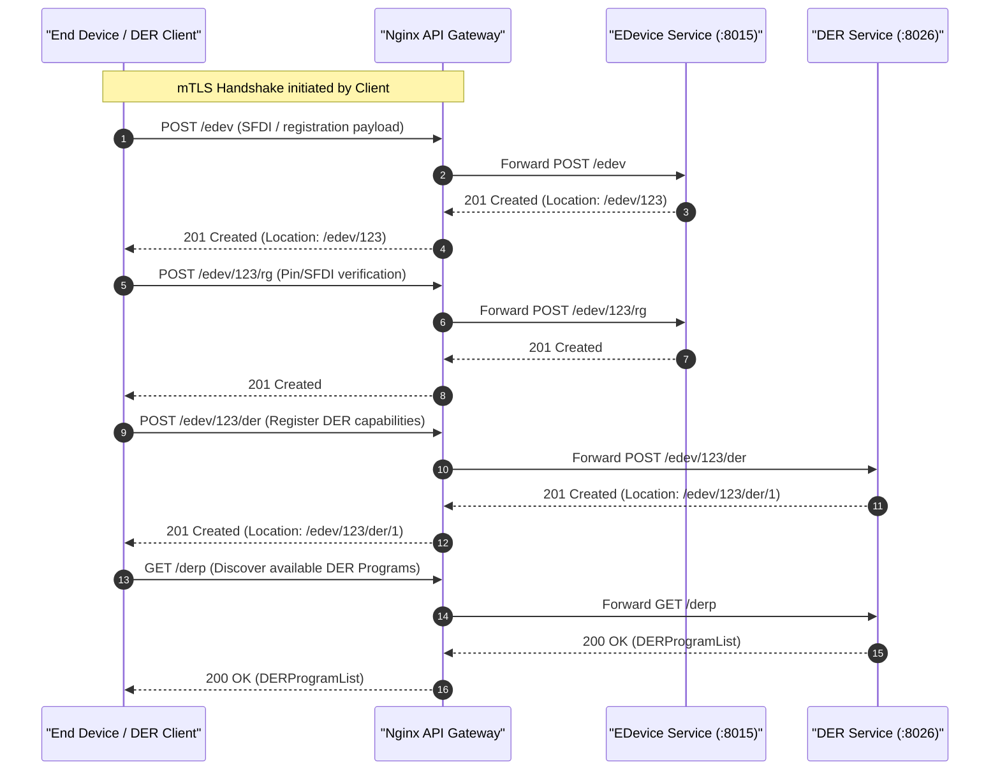
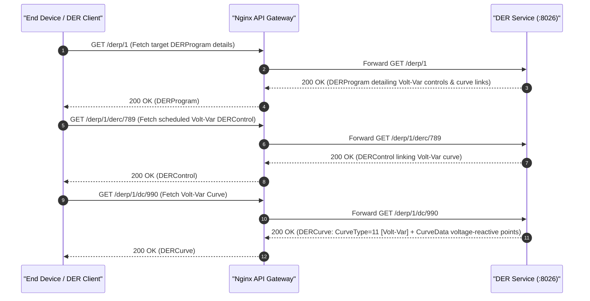
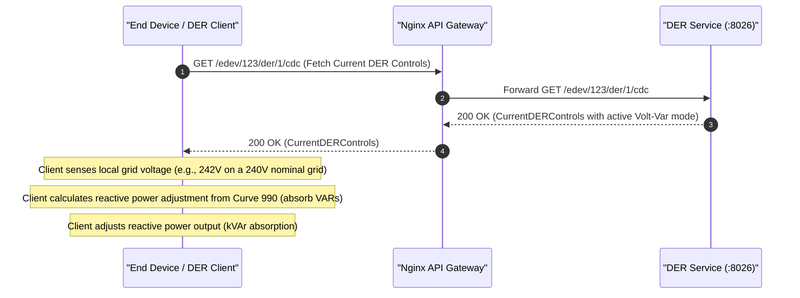
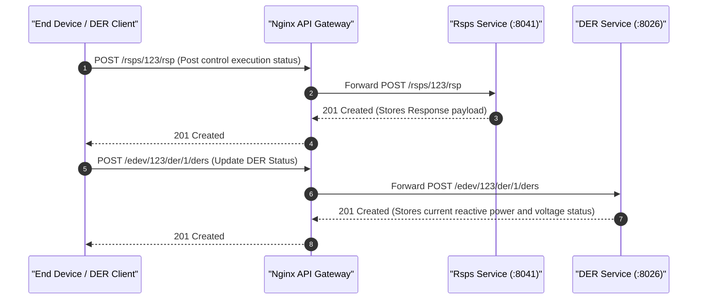
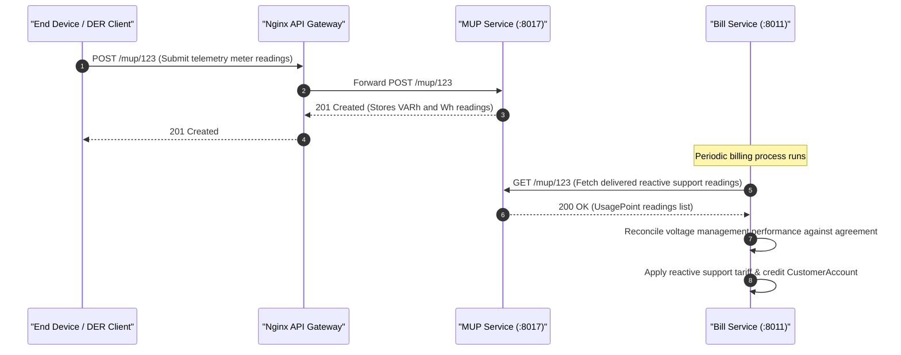

# ESI Lifecycle Sequence Diagrams: Voltage Management

This document covers the client/server interactions and sequence diagrams for the **Voltage Management** grid service (Volt-Var control / reactive power adjustment based on local voltage deviations) across all 5 ESI lifecycle phases.

---

## 1. Registration

In the Registration phase, the client registers as an End Device, registers its specific DER settings to define its active and reactive power capabilities, and discovers available Volt-Var management programs.

---

## 2. Scheduling

In the Scheduling phase, the client fetches the Volt-Var controls, schedules, and active Volt-Var curves (`CurveType=11`) that define the target voltage setpoints and reactive power injection thresholds.

---

## 3. Operation

During the Operation phase, the client monitors active controls, senses local grid voltage, and automatically adjusts its reactive power output (kVAr injection or absorption) matching the Volt-Var curve profile.

---

## 4. Verify

In the Verification phase, the client posts confirmation responses when a control is received, and uploads real-time operation status to verify curve enforcement.

---

## 5. Settlement

In the Settlement phase, the telemetry reported via Mirror Usage Points is processed by the Billing service to reward or credit the customer account for providing reactive voltage support.

